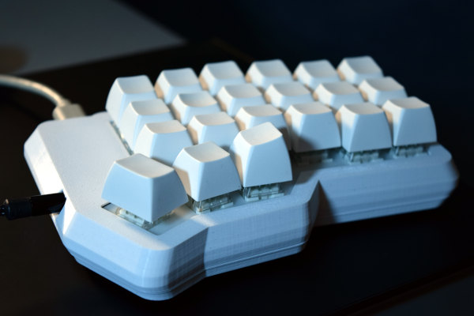
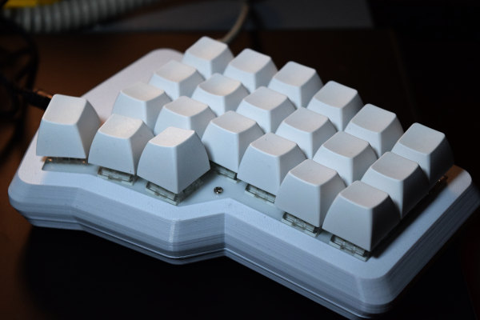

# 3D printed case for Corne

Here are models for a 3D printed case for the wonderful [Corne
keyboard](https://github.com/foostan/crkbd) designed by
[@foostan](https://github.com/foostan).  The top piece in this model
covers up the OLED, so this isn't a good choice if you are using
underlighting or the OLED.

